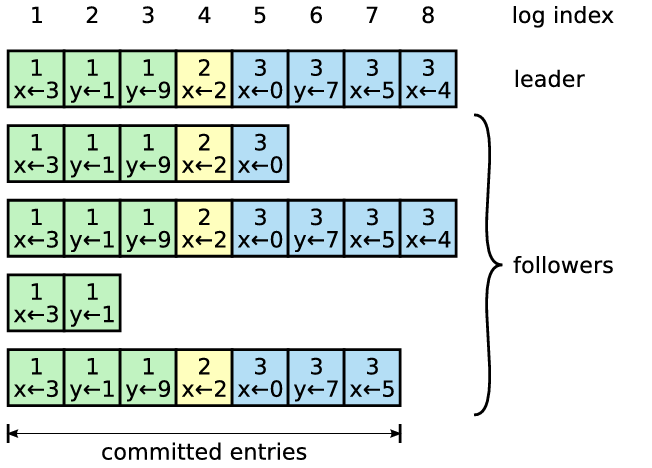
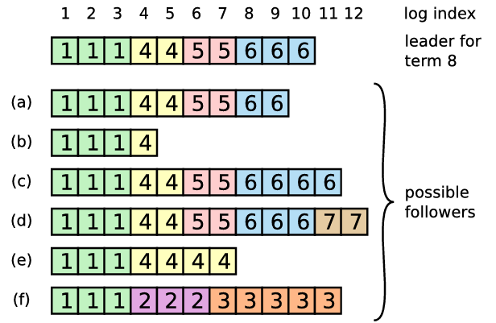
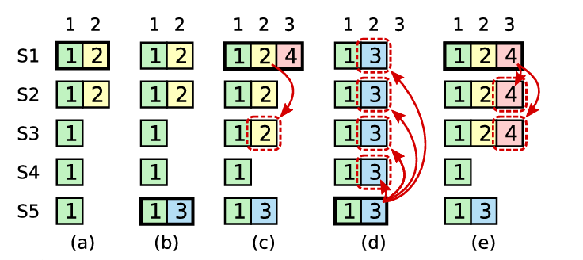

# Raft 简析

Raft 是用于分布式系统日志管理的共识算法，服务于上层状态机应用，通过保证分布式系统的状态一致性，从而对外形成高度可用的的单一状态机。

### 1. 基本特点：
**1）三种状态：leader（领导者）、follower（追随者）、candidate（候选者）**   
领导者：每个任期只有一个领导者，通过选举选出，负责处理所有客户端的请求，同时向追随者追加日志条目。  
追随者：被动接受来自请求领导者和候选者的请求，并做出响应。  
候选者：启动新的任期，发起选举投票，选出新的领导者。    

系统正常运行时只有领导者和追随者，候选者只有在发起选举才会出现。

**2）Term（任期）**    
任期机制可以说是 Raft 协议的核心，日志复制、领导选举、单一领导者都是围绕任期展开的。

**单一领导**    
每一轮新的选举都会产生新的任期，新的任期意味着旧任期领导者失效，将让位于新的领导者。这是保持只有一个领导者的必要条件。

**信息过滤**   
充当逻辑时钟，用于检测过时信息。当新任期开始时，节点会拒绝接受任何旧任期的请求，隔绝了旧任期的干扰。

**任期交换**  
每个节点都会记录当前任期，在节点通信时，会交换这个任期信息，如果节点发现自己的任期更小，会更新自己的当前任期，如果更大，会拒绝请求。这样可以让每个节点都顺利过渡到新任期。

**标记日志**  
给每个日志条目添加任期信息，表示日志的新旧程度，在新任期产生领导者时，提供一致性检查，判断日志复制的起点。

**选举资格**  
由于在某个时间节点上，各节点的状态更新程度不一致，存在一些慢节点，这些慢节点的日志并不是最新的，为了保证数据的完整性，只有日志比大多数节点更新（与任期相关的 up-to-date 原则），才有选举的资格。

**3）Strong leader（强领导者）**  
Raft 的数据流向是单向的，日志条目只会从领导者流向其他节点。  
所有的客户端请求都必须经由领导者处理。

**4）single-round**  
系统正常运行下，只需一轮通信，就可以对客户端操作达成一致。

### 2. Leader election（领导选举）
#### 2.1 选举规则
**1）majority vote（多数投票）**   
**选举过程**  
发起投票：当一个节点在一个选举超时的时间内没有收到来自领导者的心跳消息，比如当前领导者崩溃，将会转化为候选者向其他节点发起选举投票请求。     
选举结果：候选者会把票投给自己，如果获得大多数的投票，选举成功，转为领导者；否则，选举失败，等待下一轮选举。
建立权威：选举成功后，会定期发送心跳报文，告知其他节点自己是新任期的领导者，旧领导者会退位（如果存在），新的选举不会发生。

**选举失败的原因**   
集群正常运行的节点已经低于半数，或者发生了分裂投票，有多个节点几乎同时发起选举。当然还有网络的原因，比如网络延迟等。        

**节点数量**   
集群的节点数必须是奇数（论文建议是3或5），当节点数为 2n+1时，大多数指的是 >=n+1 的节点数。   

**2）randomized election timeouts（随机选举超时）**    
每个节点都会设置一个选举超时时间，作为发起选举的定时器，一旦时间走完，就会发起选举投票。当节点收到有效请求时，都会重置超时时间。

重置超时重置的情形：
a. 节点收到领导者的心跳或者追加日志请求时，由于存在有效领导者（不可以是旧任期），不需要发起选举；   
b. 节点发起选举投票时，由于节点本身并不一定具备选举资格（看之前描述），为了成功选出领导者，防止它频繁发起投票，必须重置时间；   
c. 节点投票给候选者时，说明已经有选举在进行，无需自己再发起投票了，重置可以防止分裂投票。   

**问题：split vote（分裂投票）**    
当多个节点几乎同时发起投票请求时，多个候选者都没有得到大多数票，形成分裂投票，这会造成任期内无法选出领导者。在新的选举投票开始时，分裂投票可能会反复出现，这会使系统处于停滞状态。

随机的超时时间可以有效解决这个问题。
第一，由于超时时间是随机生成的（150ms~300ms），所以各节点同时变成候选者的概率比较低，同时心跳会在节点超时之前到达，超时时间会被重置；
第二，候选者发起选举时会随机重置超时时间，这样降低了下次选举时与其他节点同时超时的可能性。   

### 3. Log replication（日志复制）
#### 3.1 日志作用
1）重传   
由于领导发送日志条目给其他节点时，请求可能会丢失，所以需要保留正在传输的日志条目；     
2）顺序   
日志可以保证以相同的顺序，把所有命令复制其他节点上；   
3）持久化   
命令执行需要持久化，日志可以很方便地实现持久化，在跟随者崩溃后恢复或者新加入节点时，可以将其日志同步到最新；   
4）缓存   
对于追随者而言，无法判断日志条目是否已提交，需要先缓存这些条目，后续收到领导者的提交信息后，再进行操作。   

#### 3.2 日志条目（log entry）    
**条目格式**：{ term, command }      
term 用于标记该日志条目是由哪个任期的领导者追加的；
command 表示客户端发送来的命令；   

**条目存储**   

日志条目会按顺序追加在日志文件中。领导者只进行追加操作（append only），不会删除或者更改条目，因此每个索引只对应一个日志条目。

**条目提交（committed）**    
每个日志条目经过这个过程：append -> committed -> apply。  
领导者追加日志条目后，后发起日志追加请求广播，将日志复制到所有节点上。只有当条目被复制到大多数节点上时，条目才算是被提交，其命令才可以被上层状态机执行。    

#### 3.3 日志一致性（log consistency）
不同节点的日志包含相同顺序的相同命令。   
这种性质保证各个节点的状态机会按照相同的顺序执行一系列相同的命令，得到相同的状态和相同的输出返回给客户端，最终，节点集群会表现为一个单一、高度可靠的状态机。    

如何保证日志一致性？   
由于节点奔溃等原因，跟随者与领导者的日志会出现不同程度的差异。raft 使用简单的一致性检查，对跟随者的日志条目进行删除和追加操作来保证日志一致性。

（图片中每个小方格是日志条目，方格中数字表示任期）

**一致性检查**
例子：上图中

**日志同步**

**问题：split brain（脑裂）**

### 4. Safty（安全性）
#### 4.1 数据完整性

如何保证领导者包含所有已提交的日志条目？   
添加选举限制，限制哪些服务器可以成为领导者。
限制规则如下：候选者发送RequestVoteRPC时，包含自己的log信息，当追随者收到RPC后，
	        通过index和term比较两者间哪个logs更新，如果追随者更新，则拒绝投票，候选者将无法成为候选人。

#### 4.2 
新任期的领导者如何确定之前任期的日志条目是否已提交?

#### 5. 其他
**5.1 节点奔溃**   

**5.2 客户端交互**   

#### Membership changes

论文链接：